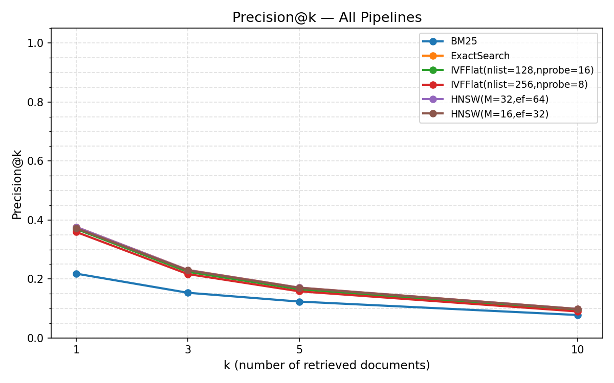
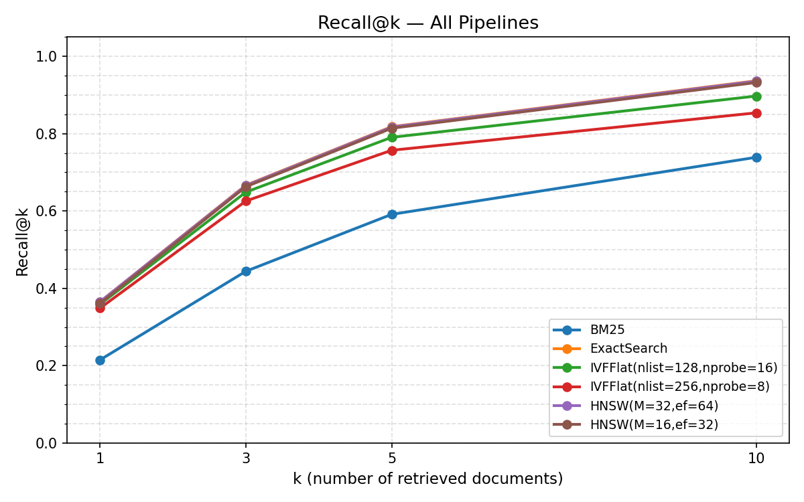
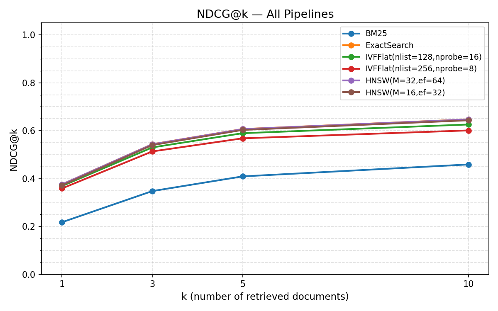
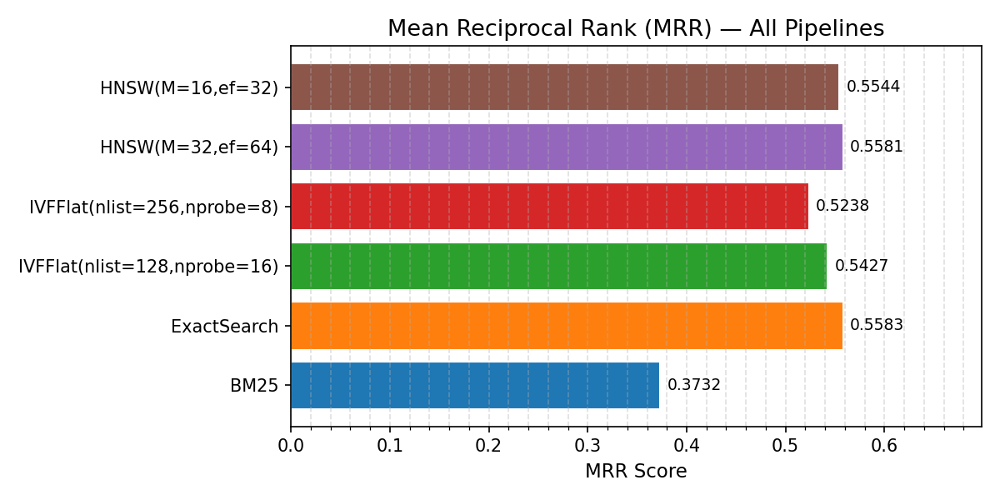
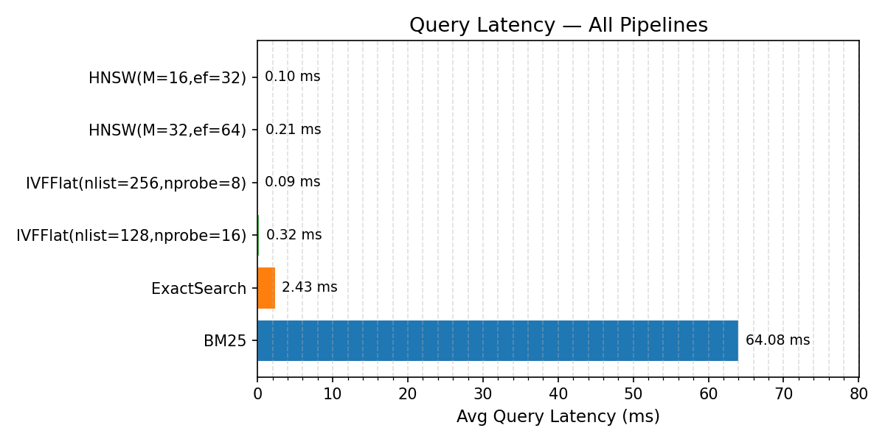
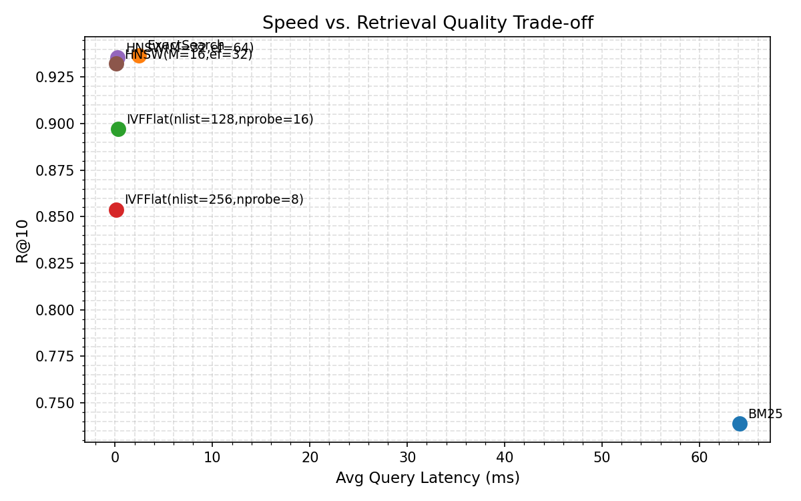

# Word Embedding-Based Semantic Search Engine

A semantic search system that retrieves relevant documents using dense vector embeddings and Approximate Nearest Neighbor (ANN) indexing, benchmarked against traditional keyword-based search on the MS MARCO dataset.

---

## Overview

Traditional keyword search (BM25) fails when a query uses different words than the document — searching *"automobile accident statistics"* won't find a passage about *"car crash fatality data"*. This project builds a semantic search engine using Sentence-BERT embeddings that understands meaning rather than matching words.

We implement and benchmark four retrieval pipelines:

| Pipeline | Type | Description |
|---|---|---|
| BM25 | Sparse (baseline) | Classical keyword matching |
| ExactSearch | Dense (brute-force) | FAISS IndexFlatIP — upper bound accuracy |
| IVFFlat | Dense (ANN) | Inverted file index — fast approximate search |
| HNSW | Dense (ANN) | Graph-based index — sub-millisecond search |

---

## Results

Evaluated on 1,000 MS MARCO dev queries over a 100,000-passage corpus:

| Pipeline | P@1 | R@10 | MRR | Latency |
|---|---|---|---|---|
| BM25 | 0.218 | 0.739 | 0.373 | 63.26 ms |
| ExactSearch | 0.376 | 0.937 | 0.558 | 2.29 ms |
| IVFFlat (nlist=128, nprobe=16) | 0.369 | 0.897 | 0.543 | 0.30 ms |
| IVFFlat (nlist=256, nprobe=8) | 0.359 | 0.854 | 0.524 | 0.09 ms |
| HNSW (M=32, ef=64) | **0.376** | **0.936** | **0.558** | 0.19 ms |
| HNSW (M=16, ef=32) | 0.372 | 0.932 | 0.554 | 0.09 ms |

**Key findings:**
- Dense search beats BM25 by **+73% on P@1** and **+50% on MRR**
- HNSW(M=32) matches ExactSearch quality at **12× lower latency**
- HNSW dominates IVFFlat — better accuracy at similar speed

### Plots

| | |
|---|---|
|  |  |
|  |  |
|  |  |

---

## Project Structure

```
.
├── src/
│   ├── data_loader.py     # MS MARCO download, preprocessing, caching
│   ├── embeddings.py      # SBERT encoding (all-MiniLM-L6-v2), caching
│   ├── retrieval.py       # BM25, ExactSearch, IVFFlat, HNSW with index caching
│   ├── metrics.py         # Precision@k, Recall@k, NDCG@k, MRR
│   └── visualize.py       # All plots + qualitative analysis
├── run_experiment.py      # Full evaluation pipeline
├── search.py              # Interactive query demo
├── requirements.txt
├── proposal.md
└── results/               # Generated plots and results.csv
```

---

## Setup

```bash
git clone <repo-url>
cd project_new

python3 -m venv venv
source venv/bin/activate        # Windows: venv\Scripts\activate

pip install -r requirements.txt
```

---

## Usage

### Run Full Experiment

Downloads data, encodes passages, builds all indexes, evaluates all pipelines, and generates all plots:

```bash
python run_experiment.py --max-passages 100000 --max-queries 1000
```

All results saved to `results/`. On subsequent runs, cached data and indexes are reused — only retrieval and evaluation re-run.

**Options:**

| Flag | Default | Description |
|---|---|---|
| `--max-passages` | 100000 | Number of corpus passages |
| `--max-queries` | 1000 | Number of evaluation queries |
| `--k` | 1 3 5 10 | k values for metrics |
| `--skip-bm25` | off | Skip BM25 pipeline |
| `--embedding-viz` | off | Generate t-SNE plot (slow) |

### Interactive Search Demo

Try your own queries against any pipeline:

```bash
python search.py                        # HNSW, top 5 (default)
python search.py --pipeline bm25        # keyword search
python search.py --pipeline exact       # brute-force dense
python search.py --k 10                 # return top 10
```

Example session:
```
Pipeline : HNSW  |  k = 5
Type your query and press Enter. Type 'quit' to exit.

Query > how do vaccines protect against disease
Query > what causes inflation
Query > symptoms of high blood pressure
Query > quit
```

> **Tip:** Run the same query with `--pipeline bm25` then `--pipeline hnsw` to directly see the semantic vs keyword difference.

---

## Methodology

### Dataset — MS MARCO Passage Retrieval
- **100,000 passages** from real web documents (Microsoft Bing)
- **1,000 dev queries** — real user search queries
- **Human-annotated relevance labels** — no weak proxy labels

### Embeddings — Sentence-BERT
Model: `all-MiniLM-L6-v2` (384-dim, L2-normalised)
- Maps passages and queries into a shared semantic vector space
- Inner product of normalized vectors = cosine similarity

### ANN Indexing — FAISS
- **IVFFlat**: clusters corpus into Voronoi cells, searches nearest `nprobe` cells
- **HNSW**: builds layered proximity graph, navigates with greedy beam search

### Evaluation Metrics
- **Precision@k** — fraction of top-k results that are relevant
- **Recall@k** — fraction of relevant docs found in top-k
- **NDCG@k** — rank-aware quality (binary relevance)
- **MRR** — reciprocal rank of first relevant result
- **Query Latency** — avg wall-clock time per query (ms)

---

## Requirements

```
sentence-transformers>=2.7.0
faiss-cpu>=1.8.0
rank-bm25>=0.2.2
datasets>=2.19.0
numpy>=1.26.0
pandas>=2.2.0
scikit-learn>=1.4.0
matplotlib>=3.8.0
umap-learn>=0.5.6
```

> **Apple Silicon (M1/M2/M3):** The code sets `faiss.omp_set_num_threads(1)` automatically to prevent segfaults during IVFFlat training.

---

## References

1. Reimers & Gurevych, *Sentence-BERT: Sentence Embeddings using Siamese BERT-Networks*, EMNLP 2019
2. Nguyen et al., *MS MARCO: A Human Generated MAchine Reading COmprehension Dataset*, NeurIPS 2016
3. Johnson, Douze & Jégou, *Billion-scale similarity search with GPUs*, IEEE Transactions on Big Data, 2021
4. Robertson & Walker, *BM25: Simple effective approximations to the 2-Poisson model*, SIGIR 1994
5. Malkov & Yashunin, *Efficient and Robust ANN Search Using HNSW Graphs*, IEEE TPAMI 2020
